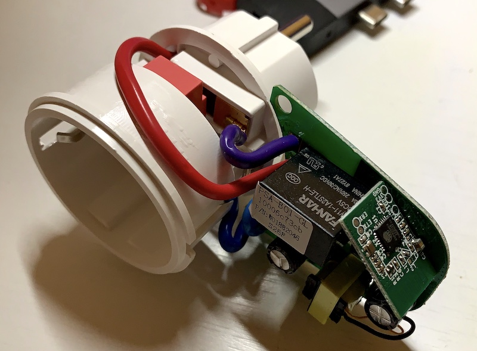
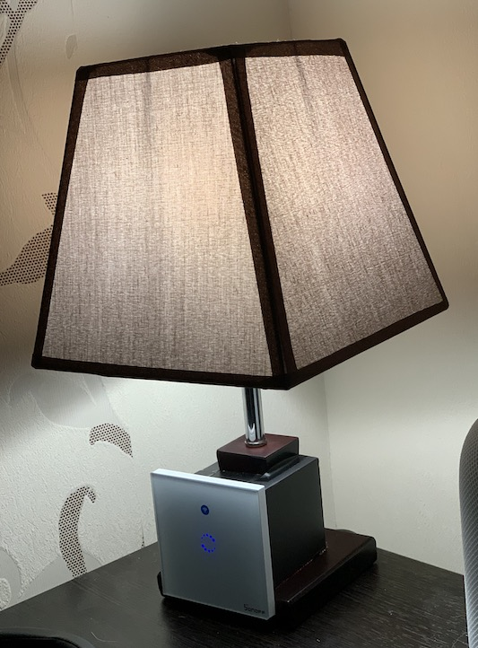
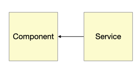
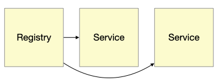

# ГОША I
*Георгий Иванович, он же Гога, он же Гоша, он же Юрий, он же Гора, он же Жора, здесь проживает?*

## Вместо предисловия

Все началось ещё до эпопеи с вирусом, как это странно ни звучит.
Для начала - занадоели в домофон звонить. У меня номер квартиры с двумя одинаковыми цифрами, самой простой по парадному, вот они и ломятся, то почта, то откройте нам к соседям.
Подумалось - а хорошо бы было, чтобы можно было переводить бибику в разные режимы: обычный, тихий, выключено, только уведомления на телефон. Или хотя бы просто выключать по расписанию, а не только руками.

В голову пришла мысля - "Умный Дом". Начал копать, чего у нас есть такого из вариантов.

Для начала, давайте разберемся, что есть умный дом, из чего он состоит и чем он отличается от тупого дома.

- Во первых, это оконечные устройства - лампочки, выключатели, розетки, датчики и прочее. Все, чем можно управлять дистанционно и/или с чего можно собирать информацию. Без участия человека, естественно. Обычный пуль ДУ от телевизора в эту категорию не попадает.
- Во-вторых, по порядку, а не по значению - контроллер умного дома, его мозг и управляющий центр. Именно он заниматеся сбором и управлением.
- В-третьих, это могут быть разнообразные хабы, цель которых быть шлюзом между своими  устройствами и контроллером. Используется производителями своих железок со своим протоколом для подключения к умному дому по его формату.

Тут надо сделать одно важное замечание: отдельно стоящее устройство, пусть даже им можно управлять по блютузу или вайфаю при помощи приложения на телефоне, умным не считается от слова совсем, это полудурок недоразвитый и по уровню развития интеллекта не отличается от того-же телевизора с инфракрасным пультом ДУ.

Второе важное замечание: Китайские решения в виде контроллера где-то там в китайском облаке и управлением со смартфона под категорию Умный Дом попадают, но в наших реалиях малоприменимы под двум причинам: чудовищное время отклика и безопасность.

### HomeKit

Первый кандидат - HomeKit, все-таки вся техника дома от яблок.

Мдя. Производители с лейблом совместимости не просто охренели, они там вкрай охренели от жадности. Цена умной HomeKit розетки - от 40$ на Амазоне, о локальных ценах я уже не говорю.

Продолжаю раскопки и выясняю, что есть такая чудная микросхема, ESP8266 - довольно мощный контроллер с вводом/выводом и WiFi на борту. Очень распространенная в определенных кругах, просто это я не в теме. И под нее есть множество прошивок, в том числе и HomeKit совместимых.
Много разных китайцев использует  8266  в своих разработках, один из таких хороших **по железу** китайцев - Sonoff. Родная Sonoff-вская умная розетка несет внутри 8266 (или ее аналог 8225), а стоит вполовину дешевле. Но китайское облако и *странный* софт. Но нам все равно нужно его перепрошить.



Sonoff S20

Вторая характерная особенность HomeKit - it just works, а вот если он не works, то узнать почему - практически невозможно, поскольку контроллером в данном случае выступать может Apple TV, HomePod или напостоянку подключенный к питалову iPad. А вытащить оттуда логи или посмотреть, что там такое приключилось - сапсем йок.

К сожалению у меня случился именно этот сценарий. А конкретно: не работали сценарии и автоматизации. Запустишь приложение на телефоне - все работает. Какое-то время. Потом что-то в системе протухает и оппа, перестает.

Справедливости ради скажу - потом выяснилось почему. И дело было совсем не в левом железе или сторонних прошивках. Но промучился я с этим около месяца и решил валить.

Третья характерная особенность HomeKit - простота, граничащая с идиотизмом. Родное приложение симатично выглядит, но его способности по созданию сценариев явно примитивны. Сторонние приложения используют гораздо больше возможности самого HomeKit, но плохо совместимы между собой и иногда запуск одного приложения портит то, что создано другим.

### HomeBridge

Отпал сразу по религиозным соображениям: nodejs, javascript...
Туда-же лесом пошли и еще несколько кандидатов, то написанные на java и на морду страшные, как корпоратиный софт из 70х, то слишком промышленные по подходу.

### HomeAssitant

А на этого товарища я подсел надолго. Написанное на питоне решение, с широкими возможностями и большим коммьюнити. Почему сразу понравилось: есть одновременно и web-gui из которого можно сделать если не все, то очень много, и файлы конфигурации на yaml, в которых руками можно дописать или исправить то, что нельзя или неудобно сделать через web. Есть готовые образы для Raspberry Pi чтобы сразу развернуть контроллер на малинке, а можно на свой собственный x86 сервер в докере или как набор пакетов питона.



Попутно хозяйство пополнялось устройствами, самодельными и не очень.

Как вы уже догадались, если бы я остановился на HomeAssitant, то и этой статьи бы не было. Так почему нет? Несколько причин.

Первая - как ни странно, популярность. Число пользователей начало переваливать некоторый предел (ну или создатели так решили), когда системой пользуются не только гики. А заставлять *"обычного"* пользователя настравивать систему редактированием конфиг-файлов несколько негуманно, поэтому упор был сделан на управление через Web UI. Хуже другое - прозрачная двухсторонняя совметимость более не поддерживлась, настройки стали хранилиться во внутреннем формате. Такое решение было принятно не однозначно, т.к. старые пользователи могли делать резервные копии конфигурации, делить их на части по-желанию / назначению, выкладывать примеры на GitHub и т.д. и т.п. Но к жалобам не прислушались.

Далее по раздачу попали интеграции. На сегодняшний момент их более 1700. Интеграция - умение HomeAssistant работать с различными частями умного дома от различных производителей, например - лампами Philips Hue, телевизорами Samsung, робопылесосами Xiaomi и всякое такое, мысля понятна.

По способу получения данных от внешних источников есть два подхода: Pull - когда ты вынужден сам за ними лазать, и Push - когда ты просишь источник данных самостоятельно отдавать их тебе по мере получения. Понятно, что второй случай более экономичен и эффективен, но таких источников среди интеграций мизер. "Отдавать тебе? А ты, собственно, кто такой?". Поэтому все интеграции причесали под одну гребенку - Pull, даже если оно раньше умело Push. А даже если и не умело, но могло делать забор данных эффективно, пользуясь своими настройками из файла, то в новой версии оно это разучилось.

К примеру: я пользовался интеграцией с роутером Mikrotik, которая по наличию устройства в сети WiFi служила дачиком присутствия владельца дома. Она умела только запрашивать данные, но делала это приемлемо: в конфигурации было указано: запрашивать каждые 3 минуты, в результаты включить только вот эти 4 mac-адреса, остальные меня не волнуют.

Новая версия интеграции задрачивает роутер каждые 10 секунд и выгребает в систему все зарегестрированные на роутере клиенты. Из-за чего у меня в блоке присуствия вместо членов семьи появилась толпа, от телевизоров до лампочек. И это не лечится.

Второя причина - это Web UI, который остался единственным инструментом для мониторинга и управления системой. Я не знаю, кто там его писал и откуда у него руки ростут, но Сафари предлагает отключить джаваскрипт сразу на первой странице, потому как оно жутко тормозит и жрёт батарею. Firefox выжидает пару-тройку переходов по страницам и тоже сдается с аналогичным предупреждением.

Единственно что я вынес полезного из общения с их междумордием, то что оно имеет собственный API по вебсокетам и есть альтернативные решения, типа [TileBoard](https://github.com/resoai/TileBoard), не для конфигурирования, но простые, симпатичные и легонькие даже для настенных экранов.

## Собственно Гоша

В этот момент любой нормальный программист, который до этого ни разу не писал системы по управлению умным домом, решает написать свою собственную. Я нормальный. Но я сразу не претендовал на то, что напишу самую лучшую, саму гениальную. Я просто хотел чтобы она делала только то, что нужно мне, так как нужно мне. И сразу, чтобы два раза не вставать, написать её на Go. До этого я пробовал гошничать помаленьку, но в микромасшатабах. А тут такой случай подвернулся...

Начальные требования:

1. Конфигурационные файлы похожие на братьев из HomeAssitant.
2. Внешняя интеграция - преймущественно MQTT (*подробности дальше*).
3. Интеграция с HomeKit: дожна выступать в роли хаба.
4. Полная совместимость с API HomeAssitant в плане мониторинга, TileBoard должен работать как влитой, пока не напишется своя панель.

Гошники любят называть свои проекты, начиная с go : gorm, goproxy, go-telegram-bot, ...
Поэтому с названием особых проблем не возникло, **Go** **S**mall **H**ome **A**utomation, Gosha, Гоша.

Атомарной единицей описания оконечного устройства является Компонент.

**Component**

|property|type  |
|--------|------|
|domain  |Domain|
|id      |string|
|platform|string|
|state() |State |

Domain - перечеслимый тип, описывает область, к которой компонент относится, т.к. выключатель, датчик, группа...
id - строка, уникальный идентификатор компонента. Платформа - тип интеграции, как взаимодействовать с реальным компонентом. По-умолчанию, если не указано иначе, это "internal" - внутренний компонент, без двойника в реальном мире.
Полный идентификатор складывается из имени домена, точки и краткого идентификатора.
Если мы в конфигурационном файле опишем датчик погоды

```
components:
  - sensor: theweather
```
он получит полный id в виде `sensor.theweather`, платформа `internal`

Каждый компонент имеет Состояние. Это вычисляемое на лету значение, служит для передачи данных о компоненте в другие модули системы.

**State**

|property  |type                  |
|----------|----------------------|
|entity_id |string                |
|state     |string                |
|attributes|map[string]interface{}|

entity_id - строка, id компонента, к которому это состояние относится. state - строка, собственно само состояние в котором компонент находится ("on", "off", ...) И, опционально, может иметь дополнительный набор аттрибутов в виде пар ключ-значение, ключ - наименование аттрибута, значение - величина аттрибута, любого типа.

Есть неуправляемые компоненты, не предназначенные для управлением пользователем (человеком) - датчики. Они меняют свое состояние исключительно самостоятельно (температура, движение, дверь открылась, выглянуло солнце). Есть управляемые - выключатели, диммеры, ...

Система взаимодействует с Компонентом не напрямую, а при помощи Сервиса.



И есть Service Registry, который занимается созданием нужных сервисов и управлением ними.

