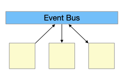
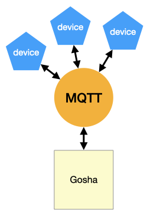
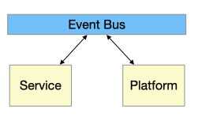
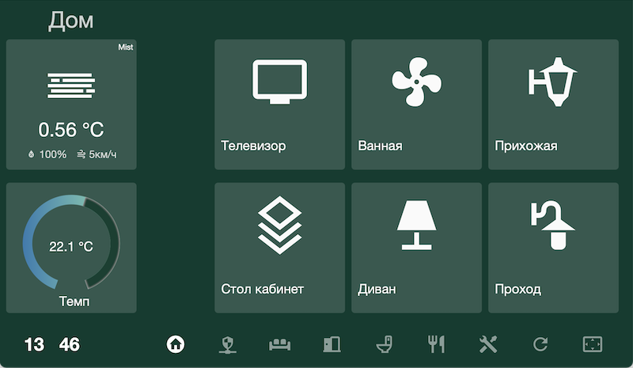
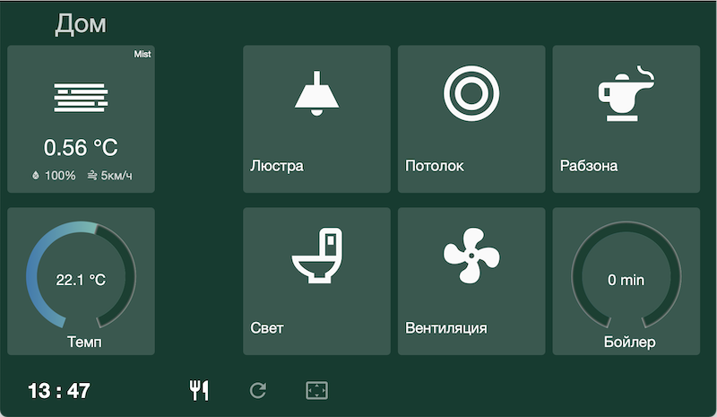
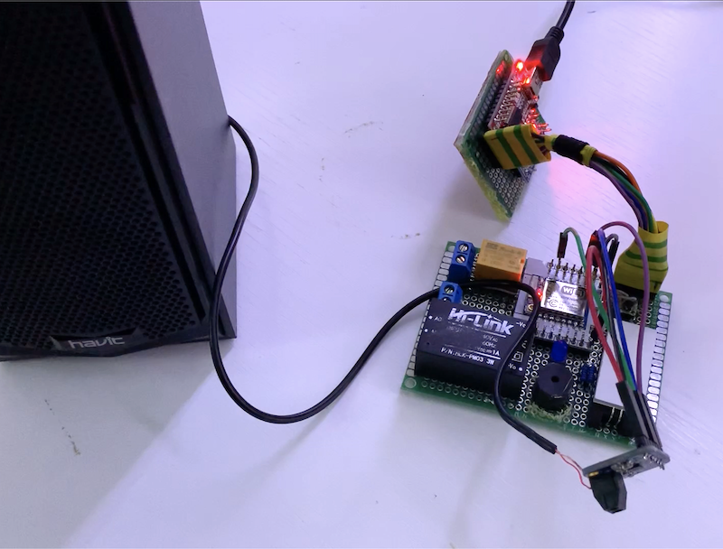
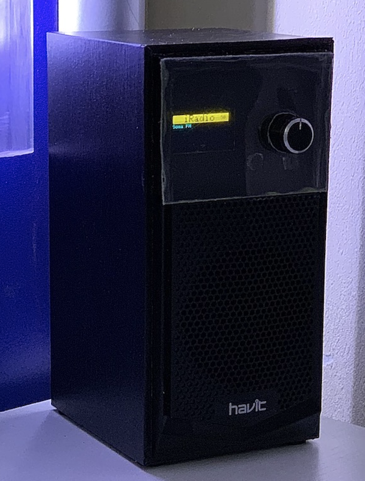

# ГОША I
*Георгий Иванович, он же Гога, он же Гоша, он же Юрий, он же Гора, он же Жора, здесь проживает?*

## Вместо предисловия

Все началось ещё до эпопеи с вирусом, как это странно ни звучит.
Для начала - занадоели в домофон звонить. У меня номер квартиры с двумя одинаковыми цифрами, самой простой по парадному, вот они и ломятся, то почта, то откройте нам к соседям.
Подумалось - а хорошо бы было, чтобы можно было переводить бибику в разные режимы: обычный, тихий, выключено, только уведомления на телефон. Или хотя бы просто выключать по расписанию, а не только руками.

В голову пришла мысля - "Умный Дом". Начал копать, чего у нас есть такого из вариантов.

Для начала, давайте разберемся, что есть умный дом, из чего он состоит и чем он отличается от тупого дома.

- Во первых, это оконечные устройства - лампочки, выключатели, розетки, датчики и прочее. Все, чем можно управлять дистанционно и/или с чего можно собирать информацию. Без участия человека, естественно. Обычный пуль ДУ от телевизора в эту категорию не попадает.
- Во-вторых, по порядку, а не по значению - контроллер умного дома, его мозг и управляющий центр. Именно он заниматеся сбором и управлением.
- В-третьих, это могут быть разнообразные хабы, цель которых быть шлюзом между своими  устройствами и контроллером. Используется производителями своих железок со своим протоколом для подключения к умному дому по его формату.

Тут надо сделать одно важное замечание: отдельно стоящее устройство, пусть даже им можно управлять по блютузу или вайфаю при помощи приложения на телефоне, умным не считается от слова совсем, это полудурок недоразвитый и по уровню развития интеллекта не отличается от того-же телевизора с инфракрасным пультом ДУ.

Второе важное замечание: Китайские решения в виде контроллера где-то там в китайском облаке и управлением со смартфона под категорию Умный Дом попадают, но в наших реалиях малоприменимы под двум причинам: чудовищное время отклика и безопасность.

### HomeKit

Первый кандидат - HomeKit, все-таки вся техника дома от яблок.

Мдя. Производители с лейблом совместимости не просто охренели, они там вкрай охренели от жадности. Цена умной HomeKit розетки - от 40$ на Амазоне, о локальных ценах я уже не говорю.

Продолжаю раскопки и выясняю, что есть такая чудная микросхема, ESP8266 - довольно мощный контроллер с вводом/выводом и WiFi на борту. Очень распространенная в определенных кругах, просто это я не в теме. И под нее есть множество прошивок, в том числе и HomeKit совместимых.
Много разных китайцев использует  8266  в своих разработках, один из таких хороших **по железу** китайцев - Sonoff. Родная Sonoff-вская умная розетка несет внутри 8266 (или ее аналог 8225), а стоит вполовину дешевле. Но китайское облако и *странный* софт. Но нам все равно нужно его перепрошить.


Sonoff S20

Вторая характерная особенность HomeKit - it just works, а вот если он не works, то узнать почему - практически невозможно, поскольку контроллером в данном случае выступать может Apple TV, HomePod или напостоянку подключенный к питалову iPad. А вытащить оттуда логи или посмотреть, что там такое приключилось - сапсем йок.

К сожалению у меня случился именно этот сценарий. А конкретно: не работали сценарии и автоматизации. Запустишь приложение на телефоне - все работает. Какое-то время. Потом что-то в системе протухает и оппа, перестает.

Справедливости ради скажу - потом выяснилось почему. И дело было совсем не в левом железе или сторонних прошивках. Но промучился я с этим около месяца и решил валить.

Третья характерная особенность HomeKit - простота, граничащая с идиотизмом. Родное приложение симатично выглядит, но его способности по созданию сценариев явно примитивны. Сторонние приложения используют гораздо больше возможности самого HomeKit, но плохо совместимы между собой и иногда запуск одного приложения портит то, что создано другим.

### HomeBridge

Отпал сразу по религиозным соображениям: nodejs, javascript...
Туда-же лесом пошли и еще несколько кандидатов, то написанные на java и на морду страшные, как корпоратиный софт из 70х, то слишком промышленные по подходу.

### HomeAssitant

А на этого товарища я подсел надолго. Написанное на питоне решение, с широкими возможностями и большим коммьюнити. Почему сразу понравилось: есть одновременно и web-gui из которого можно сделать если не все, то очень много, и файлы конфигурации на yaml, в которых руками можно дописать или исправить то, что нельзя или неудобно сделать через web. Есть готовые образы для Raspberry Pi чтобы сразу развернуть контроллер на малинке, а можно на свой собственный x86 сервер в докере или как набор пакетов питона.


Попутно хозяйство пополнялось устройствами, самодельными и не очень.

Как вы уже догадались, если бы я остановился на HomeAssitant, то и этой статьи бы не было. Так почему нет? Несколько причин.

Первая - как ни странно, популярность. Число пользователей начало переваливать некоторый предел (ну или создатели так решили), когда системой пользуются не только гики. А заставлять *"обычного"* пользователя настравивать систему редактированием конфиг-файлов несколько негуманно, поэтому упор был сделан на управление через Web UI. Хуже другое - прозрачная двухсторонняя совметимость более не поддерживлась, настройки стали хранилиться во внутреннем формате. Такое решение было принятно не однозначно, т.к. старые пользователи могли делать резервные копии конфигурации, делить их на части по-желанию / назначению, выкладывать примеры на GitHub и т.д. и т.п. Но к жалобам не прислушались.

Далее по раздачу попали интеграции. На сегодняшний момент их более 1700. Интеграция - умение HomeAssistant работать с различными частями умного дома от различных производителей, например - лампами Philips Hue, телевизорами Samsung, робопылесосами Xiaomi и всякое такое, мысля понятна.

По способу получения данных от внешних источников есть два подхода: Pull - когда ты вынужден сам за ними лазать, и Push - когда ты просишь источник данных самостоятельно отдавать их тебе по мере получения. Понятно, что второй случай более экономичен и эффективен, но таких источников среди интеграций мизер. "Отдавать тебе? А ты, собственно, кто такой?". Поэтому все интеграции причесали под одну гребенку - Pull, даже если оно раньше умело Push. А даже если и не умело, но могло делать забор данных эффективно, пользуясь своими настройками из файла, то в новой версии оно это разучилось.

К примеру: я пользовался интеграцией с роутером Mikrotik, которая по наличию устройства в сети WiFi служила дачиком присутствия владельца дома. Она умела только запрашивать данные, но делала это приемлемо: в конфигурации было указано: запрашивать каждые 3 минуты, в результаты включить только вот эти 4 mac-адреса, остальные меня не волнуют.

Новая версия интеграции задрачивает роутер каждые 10 секунд и выгребает в систему все зарегестрированные на роутере клиенты. Из-за чего у меня в блоке присуствия вместо членов семьи появилась толпа, от телевизоров до лампочек. И это не лечится.

Второя причина - это Web UI, который остался единственным инструментом для мониторинга и управления системой. Я не знаю, кто там его писал и откуда у него руки ростут, но Сафари предлагает отключить джаваскрипт сразу на первой странице, потому как оно жутко тормозит и жрёт батарею. Firefox выжидает пару-тройку переходов по страницам и тоже сдается с аналогичным предупреждением.

Единственно что я вынес полезного из общения с их междумордием, то что оно имеет собственный API по вебсокетам и есть альтернативные решения, типа [TileBoard](https://github.com/resoai/TileBoard), не для конфигурирования, но простые, симпатичные и легонькие даже для настенных экранов.

## Собственно Гоша

В этот момент любой нормальный программист, который до этого ни разу не писал системы по управлению умным домом, решает написать свою собственную. Я нормальный. Но я сразу не претендовал на то, что напишу самую лучшую, саму гениальную. Я просто хотел чтобы она делала только то, что нужно мне, так как нужно мне. И сразу, чтобы два раза не вставать, написать её на Go. До этого я пробовал гошничать помаленьку, но в микромасшатабах. А тут такой случай подвернулся...

Начальные требования:

1. Конфигурационные файлы похожие на братьев из HomeAssitant.
2. Внешняя интеграция - преймущественно MQTT (*подробности дальше*).
3. Интеграция с HomeKit: дожна выступать в роли хаба.
4. Полная совместимость с API HomeAssitant в плане мониторинга, TileBoard должен работать как влитой, пока не напишется своя панель.

Гошники любят называть свои проекты, начиная с go : gorm, goproxy, go-telegram-bot, ...
Поэтому с названием особых проблем не возникло, **Go** **S**mall **H**ome **A**utomation, Gosha, Гоша.

### Компонент, Сервис, Платформа

Атомарной единицей описания оконечного устройства является Компонент.

**Component**

|property|type  |
|--------|------|
|domain  |Domain|
|id      |string|
|platform|string|
|state() |State |

Domain - перечеслимый тип, описывает область, к которой компонент относится, т.к. выключатель, датчик, группа...
id - строка, уникальный идентификатор компонента. Платформа - тип интеграции, как взаимодействовать с реальным компонентом. По-умолчанию, если не указано иначе, это "internal" - внутренний компонент, без двойника в реальном мире.
Полный идентификатор складывается из имени домена, точки и краткого идентификатора.
Если мы в конфигурационном файле опишем датчик погоды

```
components:
  - sensor: theweather
```
он получит полный id в виде `sensor.theweather`, платформа `internal`

Каждый компонент имеет Состояние. Это вычисляемое на лету значение, служит для передачи данных о компоненте в другие модули системы.

**State**

|property  |type                  |
|----------|----------------------|
|entity_id |string                |
|state     |string                |
|attributes|map[string]interface{}|

entity_id - строка, id компонента, к которому это состояние относится. state - строка, собственно само состояние в котором компонент находится ("on", "off", ...) И, опционально, может иметь дополнительный набор аттрибутов в виде пар ключ-значение, ключ - наименование аттрибута, значение - величина аттрибута, любого типа.

Есть неуправляемые компоненты, не предназначенные для управлением пользователем (человеком) - датчики. Они меняют свое состояние исключительно самостоятельно (температура, движение, дверь открылась, выглянуло солнце). Есть управляемые - выключатели, диммеры, ...

Система взаимодействует с Компонентом не напрямую, а при помощи Сервиса.


И есть Service Registry, который занимается созданием нужных сервисов и управлением ними.


**Event Bus**

Для связи различных модулей / подсистем используется шина сообщений (Event Bus), решение подсморенное у HA и неплохо показавшее себя на практике.



Гоша использует одну общую для всех шину с несколькими именованными каналами. К примеру, при старте Конфигуратор вычитывает конфиг-файлы, создает компоненты и отправляет в шину сообщение в канал `"component:register"`, присоединив к нему созданный компонент. Сервис заранее подписан на этот канал, выхватывает сообщения и регистрирует у себя интересные ему компоненты. Switch Service - только выключатели (фильтр по домену), Сервис Группы - только компоненты, входящие в его группу. Это позволяет уменьшить зависимости между модулями и сделать общую структуру приложения более гибкой.

**Platform**

Платформа - это тип связи Гоши с реальным внешним миром, по-умолчанию `internal`. Интерфейс платформы, как и все у Гоши, прост:

|method     |argument       |return|
|-----------|:-------------:|------|
|GetPlatform|               |string|
|Start      |eventBus       |      |
|Push       |component, what|      |

GetPlatform() возвращает тип платформы, Start(eventBus) активирует платформу на шине сообщений, Push(component, what) говорит платформе, что в компоненте изменилось состояние и надо изменить состояние физического компонента вовне.

Кроме `internal` (которая по-сути есть пустышка и не делает ничего), Гоша поддерживает платформы `weather `(для получения данных о погоде с OpenWeather по их api), `telegram` для отправки уведомлений, `homekit` для связи с яблочным умным домом и `mqtt`.

**MQTT**

Можно почитать подробности на сайте mqtt, но если кратко - то

> MQTT is a Client Server publish/subscribe messaging transport protocol
> MQTT is an OASIS standard messaging protocol for the Internet of Things (IoT)

это такой легковесный протокол, базирующийся на модели издатель/подписчик, принятый как один из стандартов в миру интернета вещей.

Для работы с MQTT нужен внешний mqtt сервер. Я использую [Mosquitto](https://mosquitto.org).

Гоша очень любит и уважает mqtt и, если это возможно, предпочитает использовать для связи с внешним миром исключительно его.



---

Конкретная лампочка на кухне ничего не знает о Гоше и даже не подозревает о его существовании. Она знает только MQTT сервер - его ip адрес, логин и пароль. И еще она знает, что 

1. При подсоединении к серверу она в topic (канал) `kitchen/tele/lamp/LWT` отправить сообщение 'Online': я жива.
2. При включении/выключении сообщить в topic `kitchen/tele/lamp/STATE` 'ON' или 'OFF'
3. Слушать в topic `kitchen/cmd/lamp/POWER` команды 'ON', 'OFF' и исполнять их по мере поступления.

Все.

---

Гоша эту конкретную лампу в глаза не видел, но кроме параметров доступа к MQTT серверу он знает, что есть некая `switch.kitchen_lamp`, имена топиков, в которая она рапортует о себе, а приказывать ей нужно в таком-то топике.

Все.

---

Приложение Гоша на телефоне ничего не знает о большом брате-тёзке, оно знает о MQTT сервере и опять-же в глаза не видело эту богом забытую и тарканами засиженную лампочку на кухне, только имена топиков для общения с ней.

Все.

---

При таких раскладах Гоша может обслужить широкий спектр устройств мало заботясь об иных аспектах их бытия. У меня в соседнем докер-контейнере бежит крошечное go приложеньице, которое держит постоянную связь с микротиковским роутером и слушает его уведомления о появлении/исчезновении в сети 4х нужных мне устройств. Обновляя на MQTT соответствующие топики состояния сообщением  home / not_home. С точки зрения Гоши это 4 раздельных двоичных сенсора присутствия. Каждый из которых конфигурируется как-то так:

```
# mikrotik devices
  - binary_sensor: tanya
    platform: mqtt
    device_class: device
    availability_topic: tele/mqttmt/LWT
    payload_available: Online
    payload_not_available: Offline
    state_topic: location/tanya
    payload_on: home
    payload_off: not_home
```

**Platform <--> Service**

Платформа и соответствующий сервис то-же знают друг о друге практически ничего. И общаются исключительно через шину сообщений.



Платформа получила из внешнего мира данные о смене состояния компонента, опознала, вычислила его id, сформировала Status сообщение, отправила в шину и пошла дальше баиньки.

Сервис получил сообщение, опознал Компонент как свой, сравнил Состояние. И если оно отличается от существующего - изменил свойства в компоненте.

Если система попросила Сервис изменить свойства Компонента, - Сервис планирует изменения, формирует сообщение с новым состоянием и отправлет его в шину. Там оно подхватывается Платформой и отправляется в реальный мир в виде команды реальному устройству.

### Действие, Триггер, Условие, Автоматизация

На кой бы это всё было нужно, если бы Гоша не умел сам выполнять отпределенные действия без ручного вмешательства. Этим занимается заднее полушарие Гоши, Автоматор.
Такое поведение отпределяется набором Автоматизаций. 

**Automation** 

Цепочка проста: 1..n триггеров определяют настуление событий. При положительном срабатывании любого из Триггеров (логичское ИЛИ) проверяются дополнительные 0..n условий. При успешной проверке их всех (логическое И) выполняются 1..n Действий.

**Action**

Действие - выполнение одного определенного метода сервиса.

|parameter   |type  |
|------------|----  |
|service id  |string|
|action      |string|
|component id <sup>(s)</sup>|string|

Пример:

```
    actions:
      - service: service.timer
        action: cancel
        components: timer.corridor_wardrobe
      - service: service.light
        action: turn_on
        components: light.corridor_wardrobe
      - service: service.timer
        action: start
        components: timer.corridor_wardrobe
```

Если один и тот-же набор действий вызывается часто, можно оформить его в виде скрипта:

```
scripts:
# Выключить Шкаф и отменить его таймер
  - script: corridor_wardrobe_off
    actions:
    - service: service.timer
      action: cancel
      components: timer.corridor_wardrobe
    - service: service.light
      action: turn_off
      components: light.corridor_wardrobe
```

и потом вызывать через сервис, как продпрограмму:

```
    actions:
      - service: service.script
        action: execute
        components: script.corridor_wardrobe_off
```

**Condition**

Условие, описывает дополнительную проверку.

|property|type |
|--------|-----|
|platform|string|
|component id <sup>(s)</sup>|string|
|state|string|

Платформа state проверяет, находятся ли нужные компоненты в нужном состоянии:

```
    conditions:
      - platform: state
        components: switch.corridor_light switch.corridor_passlight light.corridor_wardrobe switch.hall_luster1
        state: off
```

Платформы less\_than / greater\_than проверяют, находится ли значение состояния компонентов в диапазоне меньше\_чем / больше\_чем заданного, опционально - дольше заданного срока в секундах.

|property|type |
|--------|-----|
|platform|string|
|component id <sup>(s)</sup>|string|
|value|float|
|for *optional default 0*|float|


```
    # потребление меньше 5Вт в течении 4 минут
    conditions:
      - platform: less_than
        components: sensor.bathroom_boiler_power
        value: 5
        for: 240
```

**Trigger**

Определяет наступление события.

|property|type |
|--------|-----|
|platform|string|
|component id <sup>(s)</sup>|string|
|from *optional*|string|
|to *optional*|string|

Триггер state срабатывает в момент перехода компонента из одного состояния в другое. Параметры from, to опциональны, но не оба сразу.

```
# При включении света ...
    triggers:
      - platform: state
        components: switch.bathroom_light
        from: off
        to: on
```

```
# По таймеру вентиляции ...
    triggers:
      - platform: state
        components: timer.bathroom_fan-on
        from: active
        to: inactive
```

Триггер time описывает наступление заданного времени

```
# В 05:10 ...
    triggers:
      - platform: time
        at: '05:10'
```

**Automation**

Теперь соединим это все вместе:

|property|type |
|--------|-----|
|id|string|
|triggers|[]Trigger|
|conditions|[]Condition|
|actions|[]Action|

```
automations:
# Включить Потолок в кухне по выключателю
  - automation: kitchen_light_on
    triggers:
      - platform: state
        components: switch.kitchen_switch2 switch.kitchen_light
        from: off
        to: on
    actions:
      - service: service.switch
        action: turn_on
        components: switch.kitchen_switch2 switch.kitchen_light

# Выключить Потолок в кухне по выключателю
  - automation: kitchen_light_off
    triggers:
      - platform: state
        components: switch.kitchen_switch2 switch.kitchen_light
        from: on
        to: off
    actions:
      - service: service.switch
        action: turn_off
        components: switch.kitchen_switch2 switch.kitchen_light
```

И два выключателя, kitchen\_switch2 и kitchen\_light всегда находятся в синхронном состоянии (реализция проходных выключателей).

### Web UI

У Гоши есть свой UI, предназначенный для мониторинга и управления. Сама идея подсмотрена у HA TileBoard, но реализовано с нуля на Vue.js - для этого Гоша содержит в себе web сервер с поддержкой вэбсокетов и совместимым в этой части с HA api. У меня используются две панели. Основная - Raspberry Pie c 7" tft матрицей и резестивным touch интерфейсом. Разрешение составляет. 1024x600 пикселей, поэтому размеры интерфейса подогнаны так, чтобы нормально показываться в полноэкранном киоск-режиме Хрома. Экран и малина собраны в фоторамку и вмонированы в полку. Одна из GPIO ног малинки, умеющая ШИМ, заведена на точку управления яркостью подсветки панели. Маленький демон на Go поддерживает интерфейс с MQTT и доступен Гоше как осветительный прибор (домен light) - как выключатель, но поддержкой диммирования. Соответвенно одна из автоматизаций снижает на ночь яркость панели чтобы не прожекторить во тьме.




Основной

В качестве второго экрана выступает смонтированный на стену шкафа старенький 6" asus планшет на 5-м андроиде. У него разрешение слегка поменьше, поэтому у него своя страница со своими стилями. Управления яркость нет, поэтому в страницу встроен "скринсейвер", выводящий вместо содержимого темные аналоговые часы на черном фоне.



Кухня


### SBU

Для готовых устройств на базе ESP8266 или их самодельных аналогов используется прошивка [Tasmota](https://tasmota.github.io/docs/)

Но наша история начиналась несколько с другого. Поэтому в домашнем хозяйстве под управлением Гоши трудятся несколько полностью самодельных устройств на базе ESP8266 и собственной прошивкой.

Одно из них - SBU (СБУ, Служба Безопасности Украины). 
SBU представляет собой умный дверной звонок. У него на борту есть цифровой радиоприемник на 430Mhz для приема нажатий от радиокнопки звонка и цифровой I2S аудио декодер-усилитель.



Некоторое излишество по части аудио, но зато в свободное от дежурства время оно умеет проигрывать интернет-аудио MP3 / AAC потоком до 128 kbps. На большее не хватает встроенного ОЗУ для буфферизирования потока.



С точки зрения классификации устройств умного дома она попадает по спецификацию Alarm Panel (домен alarm) - домашняя охранная система. Именно в этом классе устройств есть состояния

- Disarmed : Выключено
- Armed Home : Включено, дома кто-то есть
- Armed Away : Включено, никого нет дома
- Armed Night : Включено, Ночь на дворе

Применительно к SBU получается:

- Disarmed : никак себя не проявляем, нам пофиг.
- Armed Home : Обычный дврной звонок, по кнопке играем MP3
- Armed Away : По кнопке взводим MQTT Alarm и играем MP3
- Armed Night : Молча взводим MQTT Alarm

MQTT Alarm в виде Состояния `Triggered` подхватывается автоматизацией с отправкой уведомления в Телеграм.

ЗЫ: В режиме Armed Away играть MP3 бессмысленно, но нужно: попадаются отдельные идиоты, которые если не слышат звонка за дверью, думают что кнопка не работает и продолжают звонить до посинения.

---

Ой.
